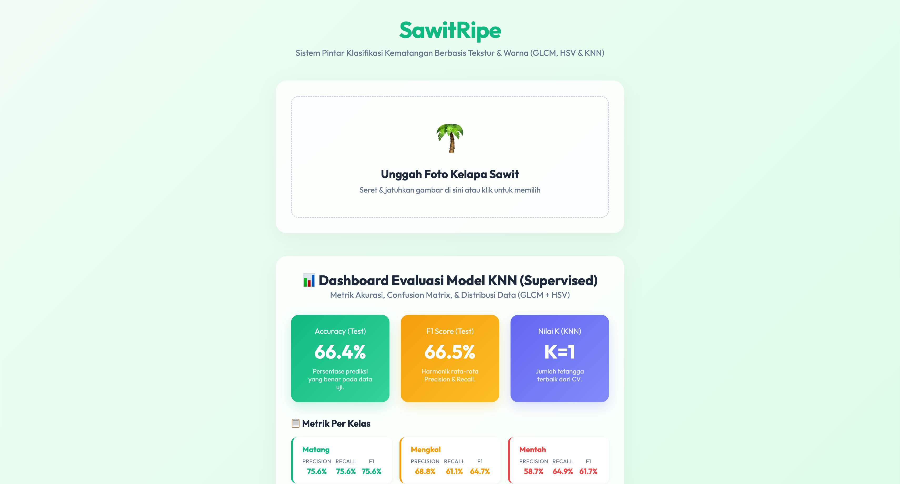

# Aplikasi Klasifikasi Kematangan Buah Kelapa Sawit

Aplikasi web cerdas untuk mengidentifikasi objek sebagai buah kelapa sawit dan mengklasifikasikan tingkat kematangannya (Matang, Mengkal, Mentah) berdasarkan analisis gambar.



## 🌟 Cara Kerja Aplikasi

Aplikasi ini menggunakan kombinasi analisis tekstur (GLCM), analisis distribusi warna (HSV), dan algoritma _Supervised Machine Learning_ (**K-Nearest Neighbors / KNN**) untuk melakukan prediksi.

Arsitektur sistem dibagi menjadi dua tahap utama: **Validasi Objek** dan **Klasifikasi Kematangan**.

### 1. Ekstraksi Fitur (Feature Extraction)
Setiap gambar yang diunggah akan diekstrak 15 fiturnya:
*   **6 Fitur Tekstur GLCM (Gray Level Co-occurrence Matrix)**: Mengukur pola tekstur permukaan.
    *   *Contrast, Dissimilarity, Homogeneity, Energy, Correlation, ASM*
*   **9 Fitur Warna HSV (Hue, Saturation, Value)**: Mengukur distribusi warna.
    *   *Mean, Standard Deviation, dan Skewness* untuk masing-masing channel H, S, dan V.

### 2. Validasi Objek (HSV Color Validation)
Sistem memiliki mekanisme pertahanan untuk mengenali apakah gambar yang diinput benar-benar kelapa sawit atau bukan (misalnya gambar batu, wajah, atau objek lain):

*   **Validasi Warna (HSV Z-Score):**
    *   Distribusi warna (9 fitur HSV) dari gambar input dibandingkan dengan rata-rata dan standar deviasi dari *seluruh* data latih kelapa sawit.
    *   Jika jarak _Z-Score_ melebihi ambang batas (Threshold ke-99 percentile) dari data latih, maka gambar ditolak karena **"Warna tidak cocok"**.

> Jika validasi gagal, objek dianggap **Bukan Kelapa Sawit**. Harus lolos agar masuk ke tahap klasifikasi.

### 3. Klasifikasi Kematangan (KNN)
Jika gambar divalidasi sebagai kelapa sawit, model **KNN** akan menentukan tingkat kematangan berdasarkan 15 fitur yang telah di-scaling.

Label ditentukan dari nama file dataset (supervised learning):
*   **Label 0 (Matang):** `berondol_10` — Buah matang, warna merah jingga / oranye.
*   **Label 1 (Mengkal):** `berondol_5` — Buah setengah matang, warna oranye kehijauan.
*   **Label 2 (Mentah):** `berondol_1` — Buah mentah, warna kehitaman.

KNN juga memberikan **confidence score** (tingkat keyakinan prediksi) berdasarkan probabilitas tetangga terdekat.

---

## 🛠️ Struktur Proyek

```
palmoil-classification-app/
│
├── app.py                      # Flask Application Server (Routing & API)
├── requirements.txt            # Dependensi Python
├── README.md                   # Dokumentasi ini
│
├── dataset/                    # Folder Data Gambar
│   ├── train/                  # Data latih (berlabel dari nama file)
│   └── test/                   # Data uji (berlabel dari nama file)
│
├── ml_pipeline/                # Logika Machine Learning
│   ├── extract_features.py     # Wrapper ekstraksi GLCM & HSV
│   ├── extract_hsv_features.py # Modul khusus ekstraksi distribusi warna HSV
│   └── train_knn.py            # Script untuk melatih model KNN & evaluasi
│
├── models/                     # Model tersimpan (.pkl & .json) hasil training
│   ├── knn_model.pkl           # Model KNN
│   ├── pca_model.pkl           # PCA (untuk visualisasi scatter plot)
│   ├── scaler.pkl              # StandardScaler
│   ├── hsv_validation.json     # Threshold validasi distribusi warna
│   └── evaluation_metrics.json # Data dashboard (Accuracy, Confusion Matrix, dll)
│
├── static/                     # Aset Frontend
│   ├── style.css               # Styling UI
│   └── script.js               # Logika UI (Upload, Render Metrics, Chart.js)
│
└── templates/                  # File HTML
    └── index.html              # Halaman utama aplikasi
```

---

## 🚀 Cara Menjalankan Aplikasi

### 1. Prasyarat Sistem
Pastikan Python 3 sudah terinstal. Buka terminal dan masuk ke direktori proyek.

### 2. Install Dependensi
```bash
pip install -r requirements.txt
```

### 3. Latih Model KNN
```bash
cd ml_pipeline
python3 train_knn.py
```
Proses ini akan:
- Mengekstrak fitur GLCM + HSV dari semua gambar
- Mencari nilai K terbaik melalui cross-validation
- Melatih KNN dan mengevaluasi pada data test
- Menghasilkan metrik evaluasi (Accuracy, Confusion Matrix, dll)

### 4. Jalankan Server Web
```bash
python3 app.py
```

### 5. Buka Aplikasi
Buka browser dan akses alamat berikut:
```
http://127.0.0.1:5000
```
Anda bisa langsung melakukan _Drag and Drop_ gambar untuk memprediksi kematangan sawit.

---

## 🔬 Metrik Tampilan Dasbor
Pada halaman utama bagian bawah, aplikasi menampilkan dasbor evaluasi model:
- **Accuracy:** Persentase prediksi yang benar pada data uji.
- **F1 Score:** Harmonik rata-rata Precision dan Recall.
- **Best K:** Nilai K optimal dari cross-validation.
- **Confusion Matrix:** Tabel perbandingan label asli vs prediksi.
- **Per-Class Metrics:** Precision, Recall, F1 per kelas (Matang/Mengkal/Mentah).
- **Visualisasi PCA (Live Scatter Plot):** Memetakan posisi sebaran gambar di ruang 2D.
